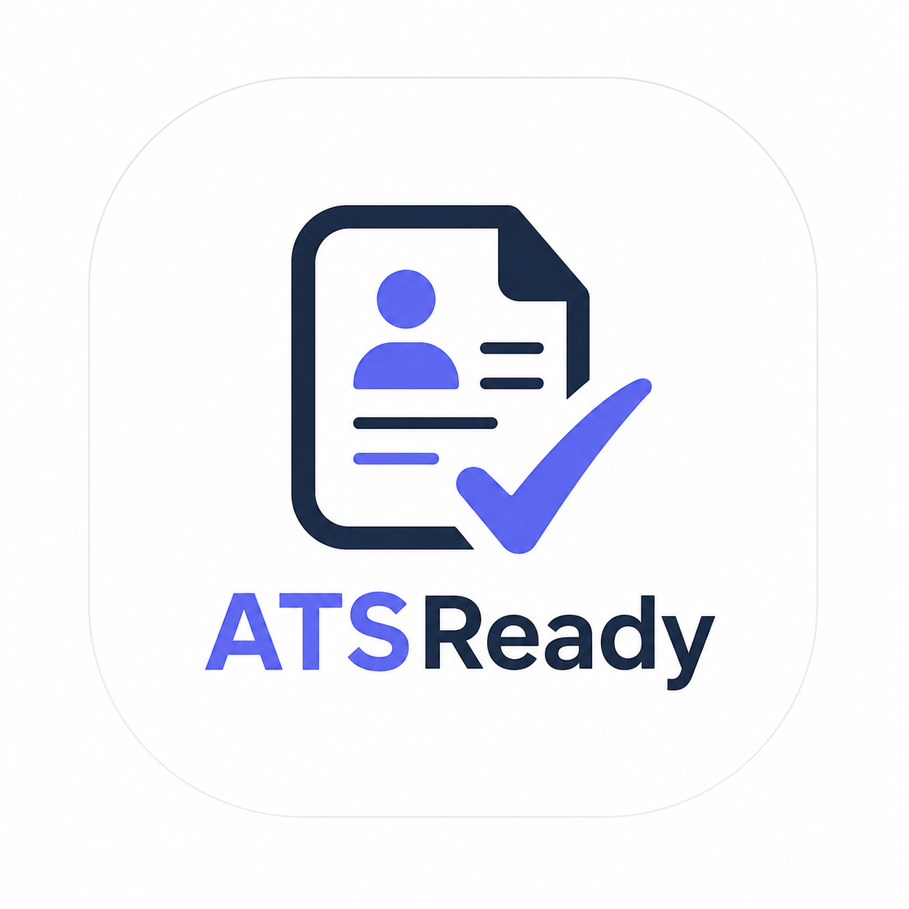

<div align="center">
  

  <h1>ATSReady — AI Resume Builder</h1>
  <p>Build a polished, ATS-optimised resume in minutes with guided AI tools and professional templates.</p>

  <p>
    
    
    
    
    
    
  </p>
</div>

---

## ✨ Features

| Feature | Description |
|---|---|
| 🤖 **AI Writing Studio** | Generate summaries, strengthen bullet points, and get skill suggestions powered by Google Gemini |
| 📄 **ATS Score** | Instantly score your resume for Applicant Tracking System compatibility |
| 🎨 **Professional Templates** | Clean, recruiter-friendly layouts with sharp hierarchy and generous whitespace |
| 🔐 **Auth System** | Secure JWT-based register & login with bcrypt password hashing |
| 💾 **Auto-save** | Resume data persisted to MongoDB with real-time section editing |
| 📱 **Responsive Design** | Fully responsive UI across mobile, tablet, and desktop |
| 🧑‍💼 **Multi-section Resume** | Personal info, work experience, projects, skills, education, and certificates |

---

## 🛠 Tech Stack

**Frontend**
- [Next.js 16](https://nextjs.org/) (App Router)
- [React 19](https://react.dev/)
- [TypeScript 5](https://www.typescriptlang.org/)
- [Tailwind CSS 4](https://tailwindcss.com/)
- [Lucide React](https://lucide.dev/) — icon library
- [React Hook Form](https://react-hook-form.com/) — form management

**Backend** *(Next.js API Routes)*
- [MongoDB](https://www.mongodb.com/) + [Mongoose 9](https://mongoosejs.com/)
- [JSON Web Tokens](https://jwt.io/) — authentication
- [bcrypt](https://www.npmjs.com/package/bcrypt) — password hashing
- [Google Gemini AI](https://ai.google.dev/) (`@google/genai`) — AI features

---

## 📁 Project Structure

```
src/
├── app/
│   ├── page.tsx              # Landing page
│   ├── layout.tsx            # Root layout & metadata
│   ├── globals.css           # Global styles & design tokens
│   ├── auth/
│   │   ├── login/            # Login page
│   │   └── register/         # Register page
│   ├── dashboard/            # User dashboard
│   ├── resume/
│   │   ├── page.tsx          # Resume creation page
│   │   ├── slidbar.tsx       # Section sidebar navigation
│   │   └── [resumeId]/       # Resume editor (dynamic route)
│   └── api/
│       ├── auth/             # Login & register endpoints
│       ├── resume/           # CRUD resume endpoints
│       ├── ai/               # AI generation endpoints
│       └── profile/          # User profile endpoint
├── components/
│   ├── brand-logo.tsx        # ATSReady logo component
│   ├── auth-shell.tsx        # Auth page layout wrapper
│   └── resume-document.tsx   # PDF-ready resume renderer
├── models/
│   ├── User.model.ts         # Mongoose User schema
│   └── resume.model.ts       # Mongoose Resume schema
├── apis/
│   └── ai.api.ts             # Client-side AI API helpers
├── lib/                      # DB connection, JWT utilities
├── middlewares/              # Auth middleware
└── types/                    # TypeScript interfaces
```

---

## 🚀 Getting Started

### Prerequisites

- **Node.js** ≥ 18
- **MongoDB** — local instance or [MongoDB Atlas](https://www.mongodb.com/atlas) connection string
- **Google Gemini API key** — get one at [ai.google.dev](https://ai.google.dev/)

### 1. Clone the repository

```bash
git clone https://github.com/Deepakdass1326/Ai-ResumeBuilder.git
cd Ai-ResumeBuilder
```

### 2. Install dependencies

```bash
npm install
```

### 3. Configure environment variables

Create a `.env.local` file in the project root:

```env
MONGODB_URI=mongodb+srv://<username>:<password>@cluster.mongodb.net/atsready
JWT_SECRET=your_super_secret_jwt_key
GEMINI_API_KEY=your_google_gemini_api_key
```

### 4. Run the development server

```bash
npm run dev
```

Open [http://localhost:3000](http://localhost:3000) in your browser.

---

## 🤖 AI Capabilities

ATSReady integrates Google Gemini to power the following features:

| Endpoint | Description |
|---|---|
| `POST /api/ai/generate-summary` | Generate a professional resume summary |
| `POST /api/ai/generate-skills` | Suggest relevant skills for a role |
| `POST /api/ai/generate-project-description` | Write compelling project descriptions |
| `POST /api/ai/generate-experiance-description` | Strengthen work experience bullet points |
| `POST /api/ai/improve-content` | Improve any existing resume content |
| `POST /api/ai/ats-score` | Score resume for ATS compatibility |

---

## 🔑 Authentication

ATSReady uses a custom JWT-based auth system:

- **Register** — `POST /api/auth/register` — hashes password with bcrypt, stores user in MongoDB
- **Login** — `POST /api/auth/login` — validates credentials, returns a signed JWT stored as an HTTP-only cookie
- Protected routes are guarded by a server-side auth middleware that verifies the JWT on each request

---

## 📜 Scripts

```bash
npm run dev      # Start development server (http://localhost:3000)
npm run build    # Build production bundle
npm run start    # Start production server
npm run lint     # Run ESLint
```

---

## 🗺 Roadmap

- [ ] PDF export / download
- [ ] Multiple resume templates
- [ ] Cover letter generator
- [ ] Job description import & tailoring
- [ ] Resume sharing via public link

---

## 📄 License

This project is for personal and educational use.

---

<div align="center">
  <p>Built with ❤️ by <a href="https://github.com/Deepakdass1326">Deepak</a></p>
</div>
